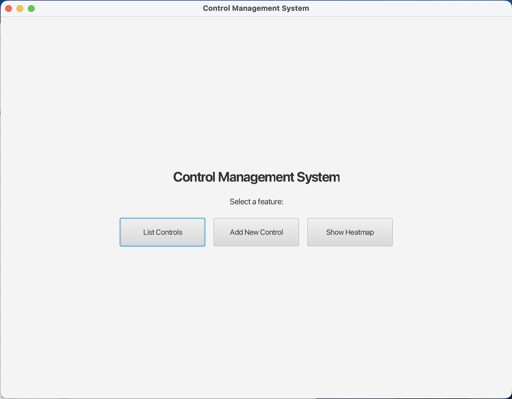
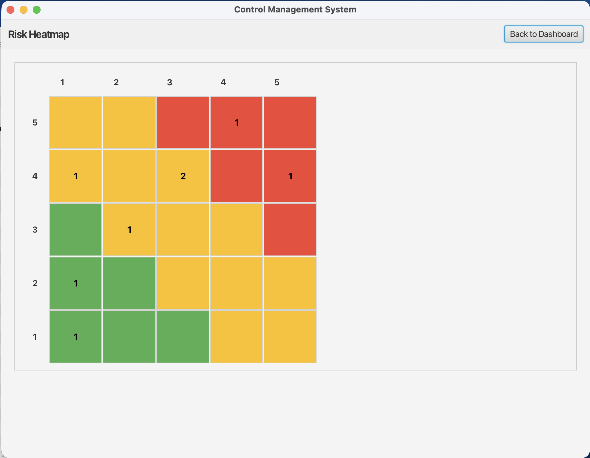

# RiskMap

> **A modern, intuitive risk management and audit tracking application**  
> Built with Java, JavaFX, and MySQL for enterprise risk management and compliance monitoring.

[](https://github.com)
[](https://www.oracle.com/java/)
[](https://openjfx.io/)

## Overview

RiskMap is a comprehensive risk management system designed to help organizations assess, track, and monitor risks and their controls.

## Key Features

- **Risk Assessment & Scoring** - Automated risk calculation based on impact, likelihood, and control effectiveness
- **Control Management** - Create, track, and manage risk controls with detailed audit histories
- **Audit Tracking** - Record and monitor audit results to measure control effectiveness over time
- **Risk Heatmap** - Visual representation of your risk landscape at a glance
- **Dashboard** - Comprehensive overview of your risk portfolio
- **Database Integration** - Persistent storage with MySQL for enterprise-level data management
- **Modern UI** - Clean, responsive interface built with JavaFX

## Features in Detail

### Intelligent Risk Scoring Algorithm

RiskMap uses a sophisticated risk calculation model:

```
Inherent Risk = Impact × Likelihood (0-25)
Control Effectiveness = Based on audit history (0-1.0)
  - All passing audits: 85% effective
  - Mixed results: Proportional to pass rate
  - All failing: 10% effective
  - No audits: 50% effective (unknown)
Residual Risk = Inherent Risk × (1 - Control Effectiveness)
Final Score = (Residual Risk / 25) × 100 (0-100)
```

### Dashboard & Visualization

- **Risk Heatmap**: Visual matrix showing risk distribution across your organization
- **Control List**: Detailed view of all controls with real-time risk scores
- **Audit Management**: Track control audits and their outcomes

## Getting Started

### Prerequisites

- **Java 21** or higher
- **MySQL 8.0** or higher
- **Maven 3.8** or higher
- Git

### Installation

1. **Clone the Repository**

    ```bash
    git clone https://github.com/yourusername/RiskMap.git
    cd RiskMap
    ```

2. **Database Setup**

    ```bash
    # Create the database
    mysql -u root -p < database.sql
    ```

3. **Configure Environment**
   Create a `.env` file in the project root:

    ```env
    DB_HOST=localhost
    DB_PORT=3306
    DB_NAME=riskmap
    DB_USER=root
    DB_PASSWORD=your_password
    ```

4. **Build the Project**

    ```bash
    mvn clean install
    ```

5. **Run the Application**
    ```bash
    mvn javafx:run
    ```

## Screenshots

### Dashboard


_Main dashboard showing risk overview and key metrics_

### Risk Heatmap


_Visual representation of risk distribution across controls_

### Control Details


_Detailed control information with audit history_

### List of Controls


_Manage and track all controls with real-time risk scores_

## Technology Stack

| Component             | Technology  | Version |
| --------------------- | ----------- | ------- |
| **Language**          | Java        | 21      |
| **UI Framework**      | JavaFX      | 24      |
| **Database**          | MySQL       | 8.0+    |
| **Build Tool**        | Maven       | 3.8+    |
| **Testing**           | JUnit       | 5.x     |
| **Config Management** | dotenv-java | 3.0.0   |

## Core Components

### Models

- **Control** - Represents a risk control with impact and likelihood metrics
- **AuditResult** - Records audit outcomes and effectiveness measurements
- **User** - Manages user accounts and permissions
- **Result** - Enumeration for audit result status (PASS, FAIL, IN_PROGRESS)

### Services

- **ControlService** - Manages control CRUD operations and relationships
- **UserService** - Handles user authentication and management
- **RiskScoreCalculator** - Computes risk scores using the proprietary algorithm

### Controllers

- **DashboardController** - Main dashboard view
- **ControlListController** - List and manage controls
- **ControlDetailsController** - Detailed control information
- **HeatmapController** - Risk heatmap visualization
- **AddControlController** - Create new controls
- **AddAuditResultController** - Record audit results

## Testing

Run the test suite:

```bash
mvn test
```

Tests are located in `src/test/java/` and cover:

- Risk score calculations
- Control effectiveness algorithms
- Audit result tracking

## Database Schema

The application uses the following main entities:

- **Controls** - Risk controls with impact/likelihood ratings
- **Audit Results** - Historical audit records for effectiveness tracking
- **Users** - Application user management

See `database.sql` for the complete schema.

## Development Workflow

1. **Create a feature branch**

    ```bash
    git checkout -b feature/your-feature-name
    ```

2. **Make your changes**
- Follow the existing code structure
- Write unit tests for new features
- Ensure your code compiles without warnings

3. **Test your changes**

    ```bash
    mvn clean test
    ```

## Known Issues & Limitations

- **Status**: Project is in active development
- Testing framework setup in progress
- Additional validation rules being implemented

## Author

**Brindza Botond**

- GitHub: https://github.com/BrindzaB
